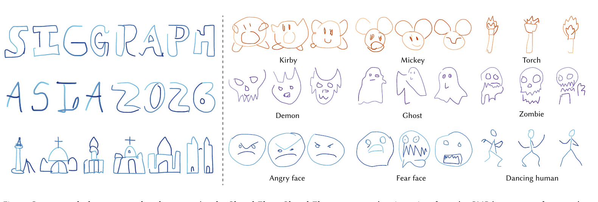
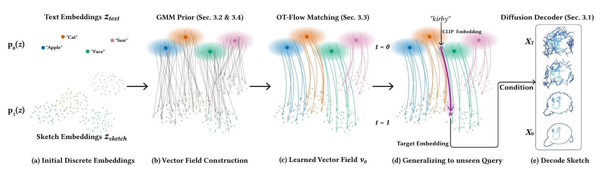

# SketchFlow

**Zero-Shot Vector Sketch Generation via GMM Prior Flow in CLIP Latent Space**

[Project page](https://doudin404.github.io/SketchFlow/) |
[arXiv](https://arxiv.org/abs/2608.21659) |
[DOI](https://doi.org/10.1145/3829340.3842307) |
[Model weights](https://github.com/doudin404/SketchFlow/releases/tag/v1.0.0) |
[Model card](MODEL_CARD.md)

Jin Zhou, Hongliang Yang, Pengfei Xu, and Hui Huang  
Shenzhen University, SIGGRAPH Asia 2026



SketchFlow generates vector sketches for open-vocabulary concepts from a model
trained on the 345 discrete QuickDraw categories. It constructs a continuous
GMM prior around CLIP text anchors, learns semantic transport to the
rendered-sketch CLIP distribution with optimal-transport conditional flow
matching, and decodes the transported feature into a 256-point stroke
trajectory.

## Method



1. A GMM expands the discrete QuickDraw text embeddings into a continuous
   source distribution.
2. OT-CFM learns a vector field from the text-side prior to sketch embeddings.
3. A hybrid 1D U-Net/Transformer diffusion model decodes the transported CLIP
   feature into vector geometry and pen states.

## Installation

Python 3.10 or newer and a CUDA-capable GPU are recommended.

```bash
git clone https://github.com/doudin404/SketchFlow.git
cd SketchFlow
python -m venv .venv
source .venv/bin/activate
python -m pip install --upgrade pip
python -m pip install -r requirements.txt
```

On Windows, activate the environment with `.venv\Scripts\activate`. Install a
PyTorch build matching your CUDA version when the default wheel is not suitable.

## Generate

Download the inference-only v1 checkpoint:

```bash
python -m script.download_weights
```

Launch the Gradio interface:

```bash
python run_ui.py --ckpt-path checkpoints/sketchflow_v1.ckpt
```

The paper defaults are 256 points, 60 denoising steps, `sigma_txt=0.025`,
variation scale `1.0`, and full flow strength. The released checkpoint is
535 MiB and has SHA-256:

```text
899f5a32e72acb349ab70cfbe2cac068faa4b05bc54d47ccbd97624087279dbf
```

The output `.npy` arrays have shape `(N, 256, 3)` and store `x`, `y`, and
pen-state values.

## Data

SketchFlow uses the official Sketch-RNN representation of QuickDraw. Download
the full per-category archives used for paper training:

```bash
python -m script.download_quickdraw --full
```

This downloads all 345 categories and is large. For a smaller development set,
omit `--full`; for a smoke test, request selected categories:

```bash
python -m script.download_quickdraw --categories cat bus rocket
```

Each archive is placed under `data/quickdraw/<category>/`, which is the layout
expected by the cache builder. QuickDraw is provided by Google under CC BY 4.0
and is not redistributed in this repository.

## Preprocess

Build fixed-length stroke arrays, category anchors, and CLIP image embeddings:

```bash
python -m script.data_prepare \
  --data-path data/quickdraw \
  --cache-dir cache/quickdraw \
  --n-points 256 \
  --splits train valid
```

Add `--build-text-stats` to estimate the optional feature perturbation
statistics used by dynamic-noise experiments.

## Train

```bash
python main.py \
  --data-path data/quickdraw \
  --cache-path cache/quickdraw \
  --devices 0 \
  --batch-size 32 \
  --n-points 256 \
  --conditioner-type clip_flow \
  --sigma-txt 0.025 \
  --sigma-perturb-std 0.25
```

Pass `--ckpt-path` to resume a Lightning training run. Use
`--load-weights-only` to initialize a new run from model weights without
restoring optimizer or trainer state.

## Evaluate

Rendered samples can be compared with real sketches using FID and optional CLIP
similarity:

```bash
python -m eval.evaluate_images \
  --real-dir rendered/real \
  --generated-dir rendered/generated \
  --prompt "ghost" \
  --output metrics.json
```

## Scope

SketchFlow is not a general text-to-image model. It works best for concise,
visually distinctive concepts that have a strong CLIP representation, including
characters, symbols, emotions, landmarks, and simple objects. Long prompts,
multi-object compositions, detailed attributes, text rendering, and exact
spatial relations may be simplified or ignored. Sampling several seeds is often
useful.

## Citation

```bibtex
@inproceedings{zhou2026sketchflow,
  title     = {SketchFlow: Zero-Shot Vector Sketch Generation via GMM Prior
               Flow in CLIP Latent Space},
  author    = {Zhou, Jin and Yang, Hongliang and Xu, Pengfei and Huang, Hui},
  booktitle = {ACM SIGGRAPH Asia 2026 Conference Papers},
  year      = {2026},
  doi       = {10.1145/3829340.3842307},
  eprint    = {2608.21659},
  archivePrefix = {arXiv},
  primaryClass  = {cs.CV}
}
```

## Acknowledgments

This project builds on PyTorch, PyTorch Lightning, Diffusers, OpenCLIP, and the
QuickDraw dataset. Please follow the licenses and citation requirements of those
projects and datasets.

## License

Code and released model weights are available under the [MIT License](LICENSE).
